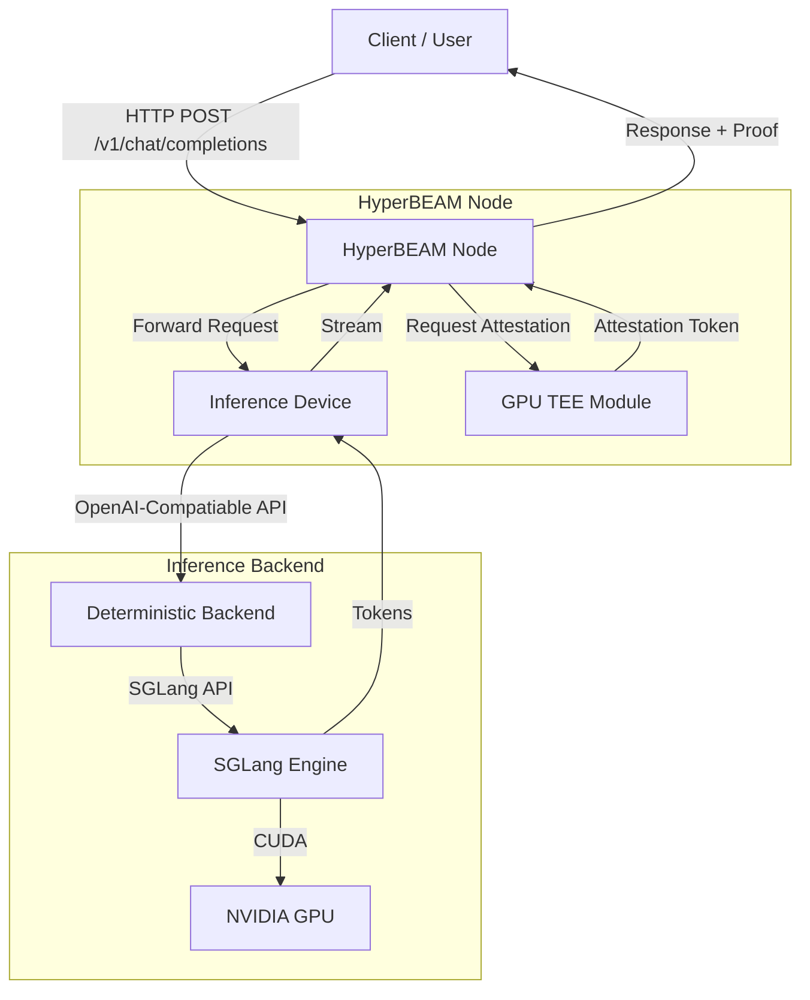
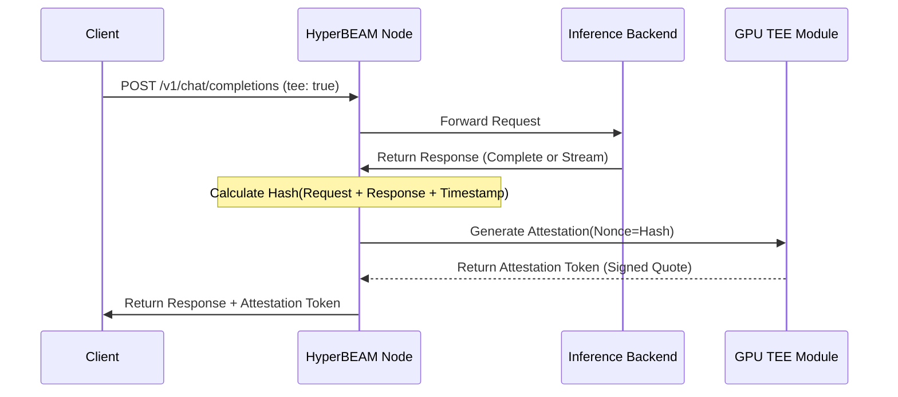

This document outlines the architecture and technical implementation of the **DCV (Deterministic, Confidential, Verification)** inference module for HyperBEAM. It focuses on the system design, the integration of the inference backend, and the mechanism for GPU TEE attestation.

## Architecture Overview

The DCV inference system enables HyperBEAM nodes to provide OpenAI-compatible AI inference services while cryptographically proving that the execution occurred on a verified NVIDIA GPU within a Trusted Execution Environment (TEE).

### System Components

1.  **HyperBEAM Node (Erlang)**: The core node software.
    *   `dev_inference`: Orchestrates the request flow, manages the backend process, and handles attestation logic.
    *   `dev_sev_gpu`: Interacts with the NVIDIA GPU TEE to generate and verify attestation tokens.
    *   `hb_http`: Enhanced with Server-Sent Events (SSE) support for streaming responses.
2.  **Inference Backend (Python)**: A lightweight proxy wrapper around **SGLang**, a high-performance inference framework.
3.  **Hardware**: NVIDIA GPUs with TEE support (e.g., H100).

### High-Level Data Flow

## Key Concepts

### Server-Sent Events (SSE) for Streaming
To support the interactive nature of LLMs, we implemented **Server-Sent Events (SSE)** within the `hb_http` module. This allows the node to stream generated tokens to the client in real-time, rather than waiting for the full generation to complete.

*   **Implementation**: The Erlang HTTP server uses chunked transfer encoding to push data frames (`data: ...`) to the client as they are received from the backend.
*   **Protocol**: Follows the standard EventStream format, compatible with standard OpenAI client libraries.

### GPU TEE Attestation
The "Confidential" and "Verification" aspects of DCV are achieved through TEE attestation. This ensures that the inference result was generated by a specific, trusted hardware environment and has not been tampered with.

#### Attestation Flow
The following sequence describes how a verifiable inference request is processed:

## API Compatibility

The inference module exposes an API compatible with the OpenAI Chat Completions API. This allows developers to use existing SDKs and tools with minimal changes.

### Supported Endpoints
*   `POST /v1/chat/completions`: Standard chat interface.
*   `POST /v1/completions`: Legacy completion interface.
*   `GET /health`: System health check.

### Supported Parameters
The backend supports standard parameters passed through to the underlying SGLang engine, including but not limited to:
*   `model`: ID of the model to use.
*   `messages`: List of chat messages (system, user, assistant).
*   `temperature`: Sampling temperature.
*   `max_tokens`: Maximum number of tokens to generate.
*   `stream`: Boolean to enable SSE streaming.
*   `top_p`, `frequency_penalty`, `presence_penalty`.
