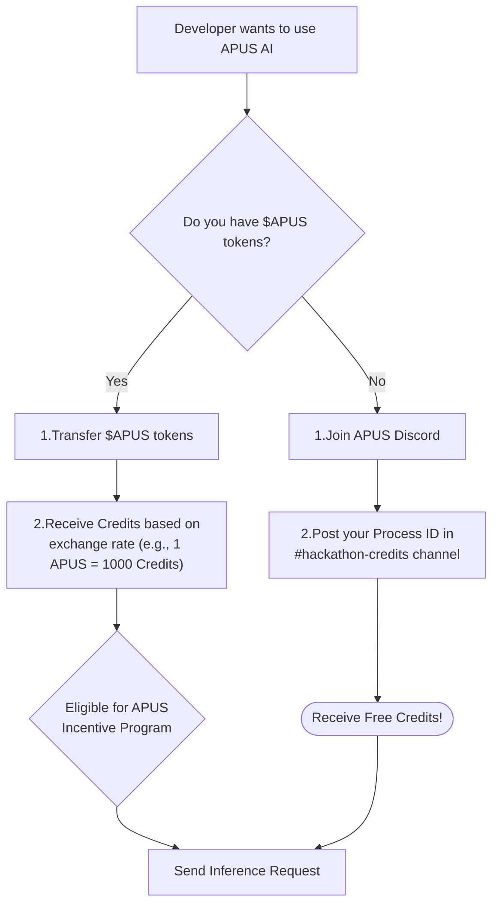

## Overview

### Prerequisites

Before you begin, please ensure you have the following set up:

- **The `aos` command-line interface (CLI):** This is the primary tool for interacting with the AO ecosystem. If you don't have it installed, open your terminal and run:
    
    ```bash
    npm i -g https://preview_ao.arweave.net
    ```
    
    If you're new to `aos` or want a refresher, we highly recommend reading the official AO Cookbook guide on [connecting `aos` with HyperBEAM nodes](https://cookbook_ao.arweave.net/guides/migrating-to-hyperbeam/aos-with-hyperbeam.html).
    
- **An Arweave Wallet:** You'll need a wallet (like ArConnect or Wander) to create your `aos` process. Your process ID is your identity on the network and is required to receive credits.
- **Connecting to the APUS HyperBEAM Node (Crucial Step)**
    
    **This is the most important step to use our service.**
    
    Our AI Inference Service runs exclusively on our custom HyperBEAM node to provide GPU acceleration. You **must** connect your `aos` terminal to this specific node to interact with our service. If you try to send messages on the default legacynet, they will not be processed.
    
    1. **Open your terminal.**
    2. **Spawn your process**: `aos my_process`
    3. **Trust apus node operator**: `ao.authorities[2] = "lpJ5Edz_8DbNnVDL0XdbsY9vCOs45NACzfI4jvo4Ba8"`
    4. **Install APM  :** `.load-blueprint apm`
        
        
        
        *Note: Please wait for the `APM client loaded` logs to load. If it do not appear after a long time, try entering any command in the AOS console to check if the system is stuck.*
        
    5. **Install Lua Lib** : `apm.install "@apus/ai"`
        
        
        
        *Note: Download may take a while. Please wait.*
        
    6. **Exit aos console** with `ctrl + c` 
    7. **Reconnect your process with APUS HyperBEAM Node**: `aos my_process --mainnet http://72.46.85.207:8734` 
    
    From this point on, all commands and code examples in this guide assume you are connected to our HyperBEAM node except additional notice.
    
### Key Concepts & Terminology

To use our service effectively, you'll need to understand these two core concepts:

- **HyperBEAM vs. Legacy Network**
    
    The AO ecosystem consists of two main environments: the `legacynet` and the newer, high-performance `HyperBEAM`. Our APUS AI Service is built exclusively on `HyperBEAM` to leverage its unique capabilities for GPU integration.
    
- **Router Process**
The Router Process is the "front door" to the APUS AI service. It's a single, stable AO process that you will send all your inference requests to. It manages the request queue, validates payments, and dispatches tasks to available GPU workers. You will use this Process ID as the `Target` for all your interactions.
    - **Router Process ID:** `D0na6AspYVzZnZNa7lQHnBt_J92EldK_oFtEPLjIexo`
- **Credits**
Credits are the units of payment for using the APUS AI service. Every inference request consumes a fixed amount of credits.
    


## Service Capabilities & Hackathon Limitations

To ensure a smooth and predictable experience for all participants during the Hackathon, our service is operating with the following specifications.

- **AI Model: Gemma-3-12B (Fixed)**
We have fixed the model to `Gemma3-12B`. While our infrastructure supports multiple models, frequently switching between them incurs significant performance overhead. Fixing the model ensures that every developer gets fast and consistent response times.
- **Context Window: 32K Tokens**
Your prompts and the generated responses share a context window of **32000 tokens**. This is the total memory the model has for a single conversation turn. Be mindful of this limit when designing long, conversational agents.
- **Session Management (KV Cache)**
A "Session" in our service refers to the model's short-term memory (the KV-Cache) of your ongoing conversation. Here's what you need to know:
    - **Persistence is Not Guaranteed:** We do not promise to retain your session's KV-Cache indefinitely.
    - **System-Wide Limit:** The service retains a maximum of **100** active sessions across all users.
    - **Developer Takeaway:** This means your agent can have short, stateful conversations. However, for long-term memory, you must manage the conversational history within your own AO process and pass relevant context in each new prompt.