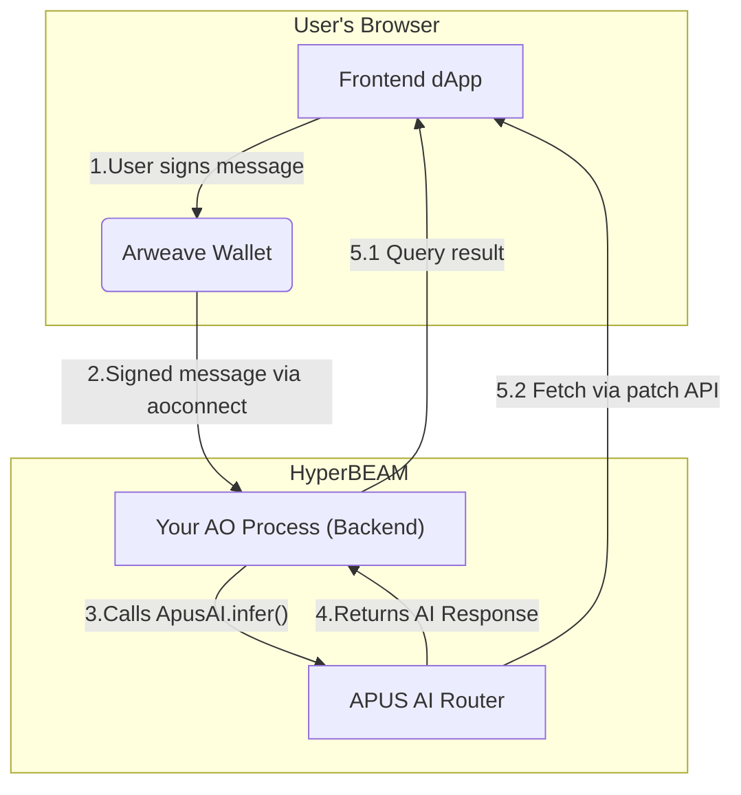
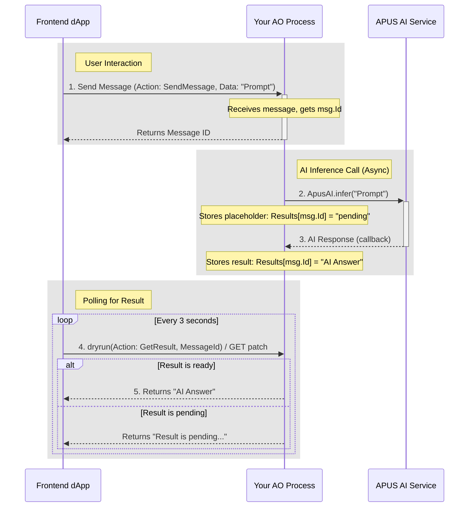

## Basic AO dApp Architecture

To build a full-stack application that interacts with the APUS AI service, you'll typically have a JavaScript frontend that communicates with a dedicated AO process acting as your application's backend.

This backend process is where you'll integrate our `@apus/ai` library and manage your application's core logic. The diagram below illustrates this common architecture.



## Prerequisites

### Prerequisites

Before you start building the frontend for your dApp, make sure you have the following ready:

- **A JavaScript/TypeScript Project:**
This guide assumes you have a modern JavaScript project set up. We will use **React** for our code examples, but the principles apply to any framework (like Vue, Svelte, or Next.js).
- **Node.js and a Package Manager:**
You'll need Node.js (version 18 or higher) and a package manager like `npm` or `yarn` installed on your system.
- **The `Arweave Wallet Kit` package:**
This is the official library for connecting Arweave wallets to your dApp. You will need to install it in your project. We'll cover the installation in the next section.
    
    ```bash
    npm install @arweave-wallet-kit/react
    ```
    
    To learn more about the Arweave Wallet Kit, you can visit its official documentation here: [Arweave Wallet Kit Docs](https://github.com/arweave-wallet-kit/arweave-wallet-kit).

## AI-Powered Quick Start

Let's do something fun. Instead of writing the code manually, we'll have an AI build the wallet connection component for you. This demonstrates the power of combining LLMs with rich, contextual documentation.

### Step 1: Download the Context File

First, download the context file for the AO ecosystem documentation. This file contains all the necessary information about `Arweave Wallet Kit` and `aoconnect` that the AI will need.

[permaweb-docs-2025-08-05.llms.txt](/sdk/permaweb-docs-2025-08-05.llms.txt)

[arweave-wallet-kit.llms.mdx](/sdk/arweave-wallet-kit.llms.mdx)

### Step 2: Use the Magic Prompt

Now, open your favorite LLM (like ChatGPT, Claude, or even the APUS AI service itself!). First, upload the `permaweb-docs-2025-08-05.llms.txt` file and `arweave-wallet-kit.llms.mdx` to provide it with context. Then, copy and paste the following prompt exactly as it is:

The Magic Prompt:

> Using the context from the provided `permaweb-docs` file and your knowledge of modern web development, create a single, complete React component named `WalletConnector.js`.
> 
> 
> This component must do the following:
> 
> 1. Use `@arweave-wallet-kit/react` to display a connect button in the header.
> 2. When the wallet is connected, it should display the user's active wallet address.
> 3. Create an example page include an input field where user can enter a text message and a "Send Message" button.
> 4. When the "Send Message" button is clicked, it must use the `message` function from `@permaweb/aoconnect` to send the text from the input field to the AO process with the ID `YOUR_PROCESS_ID`.
> 5. The component should also display the returned message ID after the message is successfully sent.

## Tutorial: Simplified Wallet Integration

If you prefer a manual approach, this tutorial will guide you through setting up wallet integration using `Arweave Wallet Kit` and `aoconnect`. We'll build the same component as the AI-powered quick start, but step-by-step.

This guide follows the official `Arweave Wallet Kit` documentation and best practices.

### Step 1: Install Dependencies

First, make sure you have the necessary packages installed in your React project.

```bash
npm install @arweave-wallet-kit/core @arweave-wallet-kit/react @arweave-wallet-kit/styles @arweave-wallet-kit/wander-strategy @arweave-wallet-kit/browser-wallet-strategy @arweave-wallet-kit/othent-strategy @arweave-wallet-kit/webwallet-strategy @permaweb/aoconnect
npm install -D vite-plugin-node-polyfills 
```

*Note: this tutorial assumes you use vite + react*

```jsx
// run npm create vite@latest to generate this file
// vite.config.ts
import { defineConfig } from 'vite'
import react from '@vitejs/plugin-react'
import { nodePolyfills } from "vite-plugin-node-polyfills"

// https://vite.dev/config/
export default defineConfig({
  resolve: {
    alias: {
      crypto: "crypto-browserify",
      stream: "stream-browserify",
    },
  },
  plugins: [react(), nodePolyfills()],
})
```

### Step 2: Set Up the Wallet Provider

To make the wallet context available throughout your app, you need to wrap your main application component (usually in `main.jsx` or `index.js`) with the `ArweaveWalletKit` provider.

```jsx
// src/main.jsx (or your app's entry point)
import React from 'react';
import ReactDOM from 'react-dom/client';
import App from './App.jsx';
import { ArweaveWalletKit } from '@arweave-wallet-kit/react';
import WanderStrategy from "@arweave-wallet-kit/wander-strategy";
import OthentStrategy from "@arweave-wallet-kit/othent-strategy";
import BrowserWalletStrategy from "@arweave-wallet-kit/browser-wallet-strategy";
import WebWalletStrategy from "@arweave-wallet-kit/webwallet-strategy";

ReactDOM.createRoot(document.getElementById('root')!).render(
  <React.StrictMode>
    <ArweaveWalletKit
      config={{
        permissions: [
          "ACCESS_ADDRESS",
          "ACCESS_PUBLIC_KEY",
          "SIGN_TRANSACTION",
          "DISPATCH",
        ],
        ensurePermissions: true,
        strategies: [
          new WanderStrategy(),
          new OthentStrategy(),
          new BrowserWalletStrategy(),
          new WebWalletStrategy(),
        ],
      }}
    >
      <App />
    </ArweaveWalletKit>
  </React.StrictMode>
);
```

### Step 3: Create the Wallet Connector Component

Now, let's create a new component `WalletConnector.js` that will handle all wallet interactions and message sending.

Start with the basic structure for connecting the wallet and displaying its address.

```jsx
// src/components/WalletConnector.js
import React from 'react';
import { useConnection, useActiveAddress } from '@arweave-wallet-kit/react';
import { ConnectButton } from '@arweave-wallet-kit/react'; // Import the button

export default function WalletConnector() {
  const { connected } = useConnection();
  const activeAddress = useActiveAddress();

  return (
    <div style={{ border: '1px solid #ccc', padding: '20px', borderRadius: '8px', maxWidth: '500px' }}>
      <h2>Wallet Connection</h2>
      <ConnectButton profileModal={true} showBalance={false} />
      {connected && (
        <div style={{ marginTop: '10px' }}>
          <p><strong>Active Address:</strong> {activeAddress}</p>
        </div>
      )}
    </div>
  );
}
```

At this stage, you have a component that allows users to connect their wallet and view their address.

### Step 4: Send Messages and Retrieve Results (HyperBEAM-Native Way)

In the HyperBEAM environment, communicating with your AO process from a frontend JavaScript application involves two key patterns:

1. **Sending Messages:** Use `aoconnect`'s `request` function to `POST` a message to your AO process's `push` endpoint.
2. **Retrieving Results:** Your AO process will expose its state (including results) using the `patch@1.0` device. Your frontend can then `GET` these exposed states via a direct HTTP request.

First, **ensure your backend AO process is set up** to receive messages and expose results. You should load the following Lua code into your `aos` process.

```lua
-- Backend AO Process Logic (Core Flow from section 2.5)

Results = Results or {} -- Your process's state where results are stored

-- Handler to listen for prompts from your frontend
Handlers.add(
    "SendInfer",
    Handlers.utils.hasMatchingTag("Action", "Infer"),
    function(msg)
        local reference = msg["X-Reference"] or msg.Reference
        -- Initialize result entry with processing status
        Results[reference] = { status = "processing", data = nil }
        ao.send({
            Target = "Bf6JJR2tl2Wr38O2-H6VctqtduxHgKF-NzRB9HhTRzo",
            Action = "Infer",
            ["X-Prompt"] = msg.Data, 
            ["X-Reference"] = reference
        })
        Send({ device = 'patch@1.0', cache = { results = Results } })
    end
)

Handlers.add(
    "AcceptResponse",
    Handlers.utils.hasMatchingTag("Action", "Infer-Response"),
    function(msg)
        -- print("Received AI response for message ")
        local reference = msg["X-Reference"] or msg.Reference
        print("AI response accepted for message " .. reference)
        Results[reference] = { status = "completed", data = msg.Data }
        Send({ device = 'patch@1.0', cache = { results = Results } })
    end
)
```

Now, let's add an `AIBox.js` to send messages using `aoconnect.request` and poll the `patch@1.0` Cache API for the result.

```jsx
// src/components/AIBox.jsx
import React, { useState } from 'react';
import { useConnection } from '@arweave-wallet-kit/react';
import { connect, createSigner } from '@permaweb/aoconnect';

export default function AIBox() {
  const { connected } = useConnection(); // Check if wallet is connected

  const [prompt, setPrompt] = useState('');
  const [requestReference, setRequestReference] = useState(''); // Stores the reference for the sent request
  const [aiResult, setAiResult] = useState(''); // Stores the fetched AI result

  const YOUR_AO_PROCESS_ID = '-MGlzBNikS86-QKR6B-6lxxoabC5pMGYoGxKWk5QVFg'; // <-- IMPORTANT: Replace with your actual AO Process ID
  const APUS_HYPERBEAM_NODE_URL = `http://72.46.85.207:8734`;

  // --- aoconnect setup for HyperBEAM ---
  // Connect aoconnect to the APUS HyperBEAM Node using the connected browser wallet as signer.
  // This setup should ideally be done once at a higher level (e.g., App.jsx or context provider)
  // in a real application to avoid re-initialization.
  const { request } = connect({
    MODE: "mainnet", 
    URL: APUS_HYPERBEAM_NODE_URL,
    signer: createSigner(window.arweaveWallet),
  });

  const handleSendPrompt = async () => {
    if (!connected) { alert('Please connect your wallet first.'); return; }
    if (!prompt.trim()) { alert('Prompt cannot be empty.'); return; }

    setAiResult(''); // Clear previous result
    let ref = Date.now().toString()
    setRequestReference(ref); // Set new reference

    try {
      // Send message to your AO process using aoconnect.request
      const data = await request({
        type: 'Message',
        path: `/${YOUR_AO_PROCESS_ID}~process@1.0/push/serialize~json@1.0`,
        method: "POST",
        'data-protocol': 'ao',
        variant: 'ao.N.1',
        "accept-bundle": "true",
        "accept-codec": "httpsig@1.0",
        signingFormat: "ANS-104",
        target: YOUR_AO_PROCESS_ID,
        Action: "Infer",
        // your tags
        // ...tags.filter(t => t.name !== 'device').reduce((a, t) => assoc(t.name, t.value, a), {}),
        'X-Reference': ref, // Unique reference for this request
        data: prompt, // The AI prompt to send
      });
      console.log(data)

      console.log('Prompt sent. Check "Sent Request Ref" for fetching results.');

    } catch (error) {
      console.error('Failed to send prompt:', error);
      setAiResult(`Error sending prompt: ${error.message}`);
    }
  };

  const handleFetchResult = async () => {
    if (!requestReference) { alert('Please send a prompt first to get a reference.'); return; }

    setAiResult(''); // Clear previous result

    try {
      // Construct the URL to query your AO process's exposed cache via patch@1.0
      // This assumes your backend Lua uses 'patch@1.0' to expose Results[clientRequestRef]
      const resultApiUrl = 
        `${APUS_HYPERBEAM_NODE_URL}/${YOUR_AO_PROCESS_ID}~process@1.0/now/cache/results/${YOUR_AO_PROCESS_ID}-${requestReference}/serialize~json@1.0`;
      
      console.log("Fetching result from URL:", resultApiUrl);

      const response = await fetch(resultApiUrl);
      if (!response.ok) {
        throw new Error(`HTTP error! status: ${response.status}`);
      }
      
      const data = await response.json(); // Data from patch is already JSON
      setAiResult(data.body); // Set the AI result to state

    } catch (error) {
      console.error('Failed to fetch result:', error);
      setAiResult(`Error fetching result: ${error.message}`);
    }
  };

  return (
    <div style={{ border: '1px solid #ccc', padding: '20px', borderRadius: '8px', maxWidth: '500px' }}>
      <h2>APUS AI Box</h2>
      <p><strong>Your AO Process ID:</strong> {YOUR_AO_PROCESS_ID}</p> 

      <textarea
        value={prompt}
        onChange={(e) => setPrompt(e.target.value)}
        placeholder="Enter your AI prompt here..."
        rows="4"
        style={{ width: '100%', padding: '10px', marginBottom: '10px' }}
      />
      <button onClick={handleSendPrompt} disabled={!connected}>
        Send Prompt
      </button>
      <button onClick={handleFetchResult} disabled={!requestReference}>
        Fetch Result
      </button>

      <div style={{ marginTop: '20px' }}>
        <h3>Details:</h3>
        <p><strong>Sent Request Ref:</strong> {requestReference || 'N/A'}</p>
        <p><strong>AI Result:</strong> {aiResult || 'N/A'}</p>
      </div>
    </div>
  );
}

```

```jsx
// src/App.tsx
import WalletConnector from './components/WalletConnector.jsx'
import AIBox from './components/AIBox.jsx'

function App() {

  return (
    <>
      <WalletConnector />
      <AIBox />
    </>
  )
}

export default App
```

## Next Steps: Integrating the APUS AI Service

You now have a frontend that can send messages to your backend AO process. The final step is to make your backend process "AI-aware" by integrating our service.

Here is the core logic your backend process needs to handle.



### Backend AO Process Logic (Core Flow)

Your backend process should follow this simple flow:

1. **Listen** for a prompt from your frontend.
2. **Call** the APUS AI service with that prompt.
3. **Store** the AI's response when it arrives.
4. **Provide** a way for the frontend to retrieve the stored response.

Here's a simplified Lua script that implements this logic:

```lua
local ApusAI = require('@apus/ai')

-- 1. Handler to listen for prompts
Handlers.add(
  "SendRequest",
  Handlers.utils.hasMatchingTag("Action", "SendRequest"),
  function(msg)
    local prompt = msg["X-Prompt"] or ""
    local options = msg["X-Options"] or {}
    -- 2. Call the APUS AI service with a callback
    ApusAI.infer(prompt, options, function(err, res)
        if err then
            print("Error: " .. err.message)
            return
        end
        print("Attestation: " .. res.attestation)
        print("Reference: " .. res.reference)
        print("Session ID for follow-up: " .. res.session)
        print("Translation received: " .. res.data)
    end)
    print(taskRef)
    msg.reply({
        TaskRef = taskRef,
        Data = "request accepted, taskRef: " .. taskRef
    })
  end
)

-- 4. Handler to let the frontend retrieve the result
Handlers.add(
  "GetResult",
  Handlers.utils.hasMatchingTag("Action", "GetResult"),
  function(msg)
    local taskRef = msg["Taskref"]
    print(taskRef)
    -- Reply with the stored result or a "pending" message
    msg.reply({
      Data = ApusAI_Tasks[taskRef] or "Result is pending..."
    })
  end
)

```

### How Your Frontend Gets the Result

After your frontend sends a message, it receives a `messageId`. It should then **poll** your backend process using this `messageId` until the response is ready.

Here's the simplified logic for your React component:

```jsx
// A simplified frontend polling function
const pollForResult = async (processId, Taskref) => {
  // Use a loop or setInterval to repeatedly call your backend
  const result = await aoconnect.dryrun({
    process: processId,
    tags: [
      { name: 'Action', value: 'GetResult' },
      { name: 'Taskref', value: Taskref}
    ],
  });

  const responseData = result.Messages[0].Data;

  // If the response is not "pending", display it. Otherwise, wait and poll again.
  if (responseData !== "Result is pending...") {
    console.log("Final AI Response:", responseData);
    // Update your UI state here
  } else {
    setTimeout(() => pollForResult(processId, messageId), 3000);
  }
}
```

This polling pattern ensures your dApp feels responsive while waiting for the AI computation to complete on the backend.